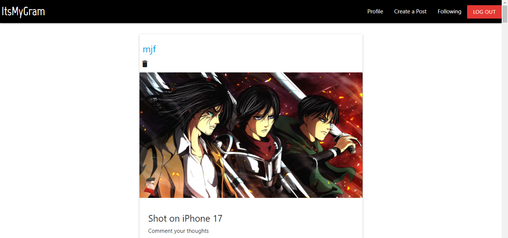
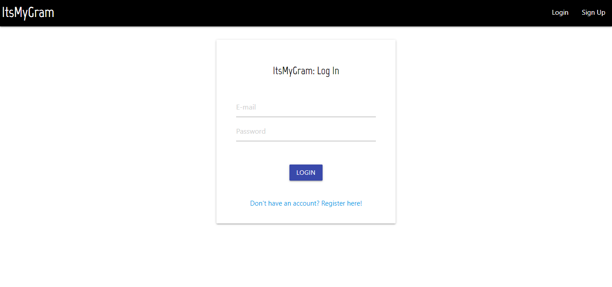
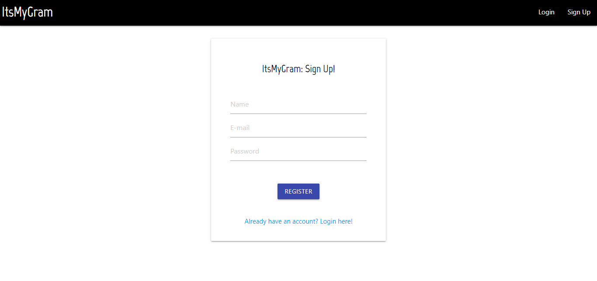
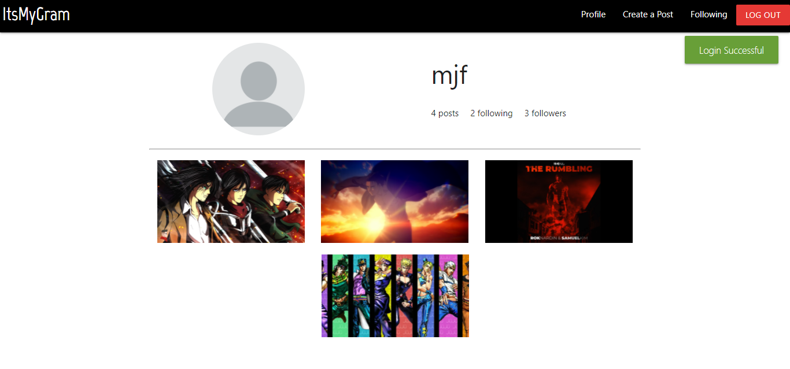
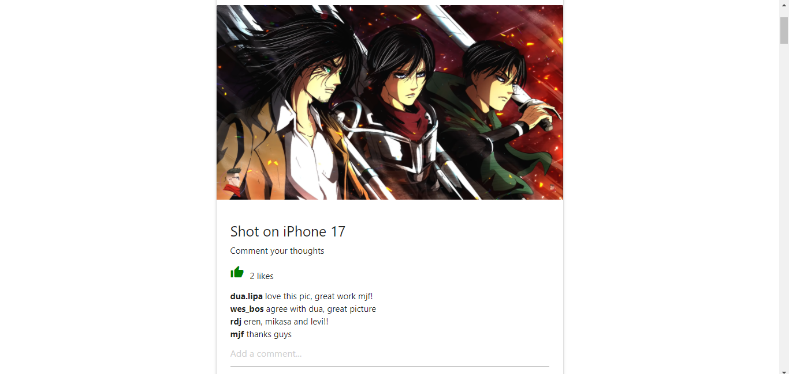
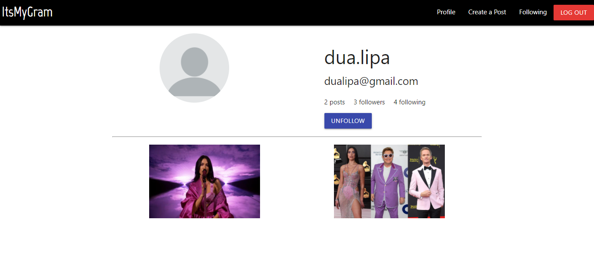

# itsmygram
A MERN Stack web app that emulates the functionalities of social media app, Instagram 

Live demo: [Click here](https://itsmygram.herokuapp.com/)

## Steps to install and run
- Clone this repository: `git clone https://github.com/SiddAjriY2Jaccount/itsmygram.git`
- Set up account on Mongo Atlas and obtain a connection URL 
- Set environment variables, following the format provided in `.env.default` file
- Run `npm install` and start the Node server in the root repository: `nodemon app.js`
- Navigate into client directory using `cd client` and run `npm install`. From the root of this directory, start the React server: `npm start`
- Navigate to default `https://localhost:3000` on the browser to start using your web app

## Screenshots

 

 

 

 

 

 

## Troubleshooting errors
Raise an issue or drop an email at [y2jsiddajri@gmail.com](mailto:y2jsiddajri@gmail.com)
